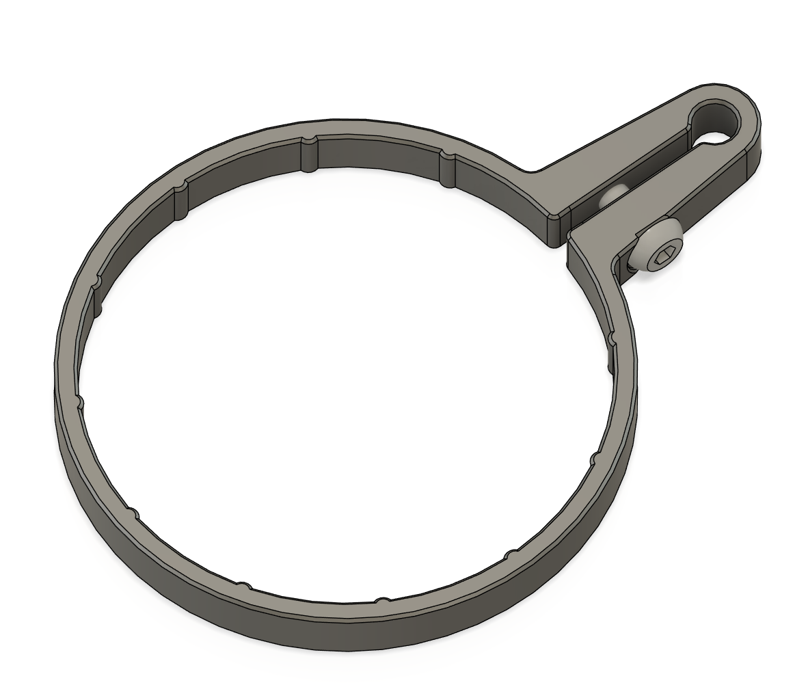
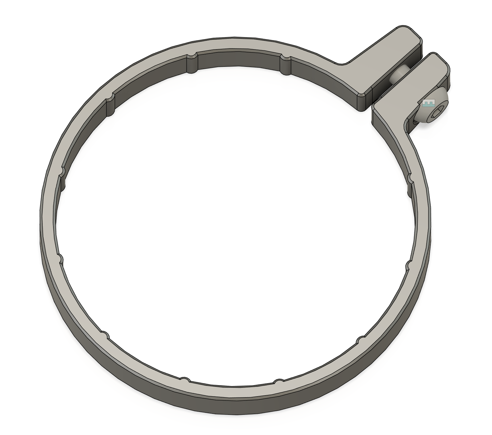
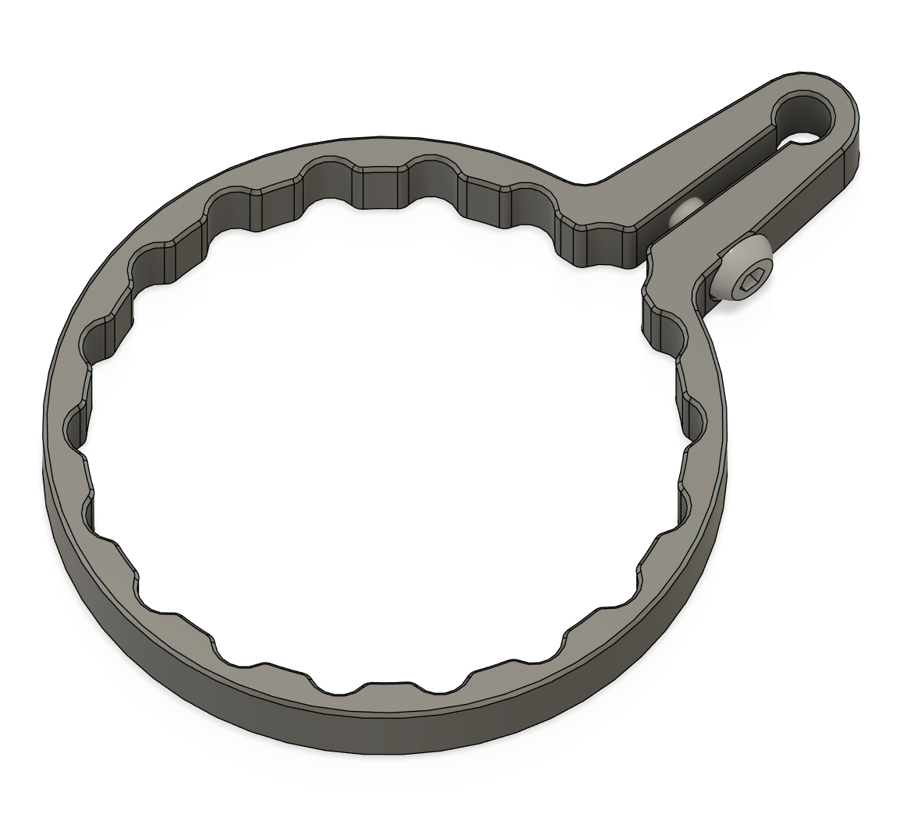

# 3D Printable Rifle Scope Throw Lever

## Print Parameters

* Primary Material: ABS/PETG/PLA you name it.
* 4x walls
* 5x tops and bottoms layers.
* 0.4~0.45mm line width
* 40% infill.

## BOM

* 1x M3x10 BHCS

## Supported Rifle Scopes

### Arken EP5

### Arken EP5 (Low Profile Throw Lever)

### Schmidt Bender PMII 5-25

